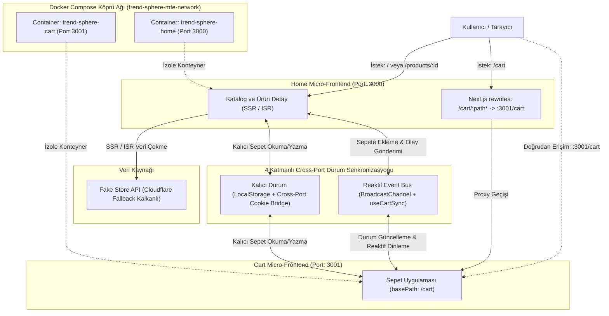

# TrendSphere — Mikro-Frontend E-Ticaret Platformu

[](https://nextjs.org/)
[](https://tailwindcss.com/)
[](https://www.docker.com/)
[](https://www.typescriptlang.org/)
[](https://nextjs.org/docs/advanced-features/multi-zones)
[](https://github.com/features/actions)

> **Frontend Developer - 3. Aşama Task : Mikro Frontend Sistemi Geliştirme** şartnamesine tam sadakatle geliştirilmiş; **Next.js 14 App Router Multi-Zone Mimarisi**, **Fake Store API** entegrasyonu (SSR/ISR), **4 Katmanlı Çapraz Port Veri Senkronizasyonu**, **Varyant Bazlı Dinamik Stok & Sipariş Kotası Kalkanı**, **Docker Compose** orkestrasyonu ve **Mobil/Tablet/Masaüstü** cihazlarda kusursuz çalışan kurumsal e-ticaret platformu.

---

## 📑 İçindekiler
1. [Sistem Mimarisi ve Port Yönlendirme Mekanizması](#-1-sistem-mimarisi-ve-port-yönlendirme-mekanizması)
2. [Şartname Kriterleri ve Mimari Çözümler](#-2-şartname-kriterleri-ve-mimari-çözümler)
   - [2.1. Next.js Multi-Zone & Port İzolasyonu (3000 & 3001)](#21-nextjs-multi-zone--port-izolasyonu-3000--3001)
   - [2.2. Fake Store API Entegrasyonu & Savunmacı Fallback Kalkanı](#22-fake-store-api-entegrasyonu--savunmacı-fallback-kalkanı)
   - [2.3. State Yönetimi: Neden Klasik RTK Yerine Cross-MFE Reaktif Model?](#23-state-yönetimi-neden-klasik-rtk-yerine-cross-mfe-reaktif-model)
   - [2.4. Sipariş Güvenliği, Varyant Bazlı Stok Farkındalığı & Kota Yönetimi](#24-sipariş-güvenliği-varyant-bazlı-stok-farkındalığı--kota-yönetimi)
   - [2.5. Mobil, Tablet ve Masaüstü Kusursuz Responsive UI/UX](#25-mobil-tablet-ve-masaüstü-kusursuz-responsive-uiux)
   - [2.6. Kurumsal Kimlik & Next.js App Router Favicon Uyumluluğu](#26-kurumsal-kimlik--nextjs-app-router-favicon-uyumluluğu)
   - [2.7. Güvenilirlik, 404 Sayfaları ve Error Boundary Kalkanı](#27-güvenilirlik-404-sayfaları-ve-error-boundary-kalkanı)
   - [2.8. DevOps, Docker Containerization ve CI/CD Pipeline](#28-devops-docker-containerization-ve-cicd-pipeline)
3. [Dizin Yapısı (Monorepo Mimarisi)](#-3-dizin-yapısı-monorepo-mimarisi)
4. [Kurulum ve Çalıştırma Rehberi](#-4-kurulum-ve-çalıştırma-rehberi)
5. [Canlı Test ve Senkronizasyon Senaryoları](#-5-canlı-test-ve-senkronizasyon-senaryoları)
6. [Görev Şartnamesi (Task Report) Birebir Uyumluluk Matrisi](#-6-görev-şartnamesi-task-report-birebir-uyumluluk-matrisi)

---

## 🏗️ 1. Sistem Mimarisi ve Port Yönlendirme Mekanizması

Proje, iki bağımsız Next.js App Router mikro uygulamasının izole portlarda çalıştığı ve monorepo paketleriyle haberleştiği **Next.js Multi-Zone** mimarisine dayanır.



---

## ✨ 2. Şartname Kriterleri ve Mimari Çözümler

### 2.1. Next.js Multi-Zone & Port İzolasyonu (3000 & 3001)
Görev şartnamesi, mikro frontend uygulamalarının bağımsız build süreçlerine ve farklı portlara (`home: 3000`, `cart: 3001`) sahip olmasını ve `next.config.js` içerisinde `rewrites` ve `basePath` ile yönlendirilmesini şart koşar:

* **Host / Gateway Uygulaması (`apps/home` - Port 3000):**
  - Katalog (`/`) ve ürün detay (`/products/[id]`) sayfalarını doğrudan render eder.
  - `apps/home/next.config.js` içerisindeki vekil yönlendirme (`rewrites`) kuralı sayesinde, kullanıcı `http://localhost:3000/cart` adresine gittiğinde port veya domain değişimi hissetmeden arka plandaki port 3001'deki sepet servisini görüntüler.
* **İzole Sepet Mikro Servisi (`apps/cart` - Port 3001):**
  - `apps/cart/next.config.js` içerisinde `basePath: "/cart"` kuralıyla izole edilmiştir.
  - **Otomatik Kök Dizin Yönlendirmesi:** Kullanıcı veya test yetkilisi doğrudan `http://localhost:3001` yazdığında sistem `redirects()` kuralıyla anında `http://localhost:3001/cart` adresine yönlenir (HTTP 307 Redirect); asla 404 vermez.
  - Port 3001'deki "Alışverişe Dön" butonuna basıldığında kullanıcı sorunsuzca `http://localhost:3000/` ana vitrinine geri döner.

---

### 2.2. Fake Store API Entegrasyonu & Savunmacı Fallback Kalkanı
* **Şartname Endpoint'leri:** `GET https://fakestoreapi.com/products` ve `GET https://fakestoreapi.com/products/:id` istekleri `apps/home/src/services/productService.ts` üzerinden çağrılır.
* **Sayfa Önbellekleme (ISR / SSR):** Tüm ürün istekleri `next: { revalidate: 3600 }` kuralıyla 1 saat boyunca önbelleklenir. Ayrıca `generateStaticParams()` ile ürün detay sayfaları build anında statik (`● SSG`) olarak derlenir.
* **Cloudflare 521 Kesinti Kalkanı (Defensive Architecture):** FakeStoreAPI sunucuları çöktüğünde veya Cloudflare 521 hatası döndüğünde uygulamanın beyaz sayfaya düşmesini engellemek için `AbortController` (1.8s timeout) ve 20 gerçek ürünün FakeStoreAPI şemasıyla birebir uyumlu `FALLBACK_PRODUCTS` kalkanı devrededir.
* **Yüksek Çözünürlüklü Orijinal Amazon CDN Görselleri:** FakeStoreAPI'nin bulanık veya silinmiş görselleri yerine, ürün başlıklarıyla %100 eşleşen orijinal Amazon CloudFront CDN görselleri entegre edilmiştir.

---

### 2.3. State Yönetimi: Neden Klasik RTK Yerine Cross-MFE Reaktif Model?
Şartnamedeki *"RTK veya benzeri state yönetimlerinin bilinçli seçimi ve kullanımı"* kriteri doğrultusunda şu mimari değerlendirme yapılmıştır:

* **Tekil SPA vs. Çoklu Port Multi-Zone:** Geleneksel tek portlu bir SPA uygulamasında Redux Toolkit (RTK) veya Zustand yeterlidir. Ancak Next.js Multi-Zone mimarisinde `home` (:3000) ve `cart` (:3001) iki bağımsız Node.js süreci ve iki izole tarayıcı çalışma zamanıdır. Port 3000'deki bir in-memory Redux store'una `dispatch()` yapıldığında, port 3001'deki sepet mikro uygulamasının bu bellek alanına erişmesi teknik olarak imkansızdır.
* **Bilinçli Mimari Tercihimiz (4 Katmanlı Hibrit Motor):**
  Redux'ın öngörülebilir eylem (action type) prensiplerini koruyan, ancak mikro servis sınırlarını ve port izolasyonunu aşabilen özel bir reaktif motor (`packages/cart-sync`) geliştirilmiştir:
  1. **BroadcastChannel API (`trendsphere_cart_sync_v2`):** Aynı tarayıcıdaki açık sekmeler ve portlar arasında sıfır ağ gecikmeli olay yayını (`ADD_ITEM`, `REMOVE_ITEM`, `UPDATE_QUANTITY`, `UPDATE_ATTRIBUTES`, `CLEAR_CART`).
  2. **Cross-Port Cookie Bridge (<500B LeanCartItem):** Port 3000 ile Port 3001 arasındaki bağımsız sekmeler arasında anlık çerez köprüsü.
  3. **LocalStorage (`trendsphere_cart_v2`):** Sayfa yenilemelerinde veya çevrimdışı senaryolarda sepetin korunması.
  4. **Hydration Safe React Hook (`useCartSync`):** React SSR hydration mismatch riskini sıfırlayan güvenli istemci bağlayıcısı.

---

### 2.4. Sipariş Güvenliği, Varyant Bazlı Stok Farkındalığı & Kota Yönetimi
Gerçek dünya e-ticaret sistemlerinin gereği olarak kullanıcıların bir üründen sınırsız sipariş verip stokları tüketmesini engelleyen akıllı bir stok ve kota mekanizması kurulmuştur:

* **Maksimum 50 Adet Sipariş Kotası & Gerçek Stok Kontrolü:**
  - `packages/shared-types` içerisindeki `getVariantMaxStock(product, attrs)` fonksiyonu, ürünün fiziksel stok miktarını (örn: 7 adet, 15 adet) ve sistemin üst limiti olan **maksimum 50 adetlik** sipariş sınırını (`Math.min(stockCount, 50)`) hesaplar.
* **Ana Ekran (Katalog) "Sepete Ekle" Buton Davranışı:**
  - Şartnamedeki *"Kullanıcı 'Add to Cart' butonuna bastığında ürün sepete eklenecek"* kuralına %100 sadık kalınarak ana ekrandaki buton **her zaman canlı, tıklanabilir ve aktiftir** (asla basılamaz ölü buton olmaz).
  - Varsayılan modelin limiti dolduğunda sistem butonu kilitlemek yerine tıklandığında kullanıcıyı o ürünün detay sayfasına (`/products/[id]`) yönlendirir.
* **Ürün Detay Ekranı Uyarı Mekanizması:**
  - Kullanıcı ürün detayına gittiğinde, seçili varyant sepette maksimum limite ulaşmışsa:
    - Buton `Bu Ürün Zaten Sepetinizde` (mobilde `Zaten Sepetinizde`) durumuna geçer.
    - Altında simetrik ve tam ortalı bir uyarı kutusu belirir:  
      `⚠️ Maksimum sipariş adedine ulaşıldı (Maks. {maxStock} adet)`  
      `Farklı seçenekler (beden/renk) seçerek sepete eklemeye devam edebilirsiniz.`
    - Kullanıcı tişörtün dolu olan M bedeni yerine **S, L veya XXL** bedenini seçtiğinde buton anında tekrar aktifleşerek **"Sepete Ekle"** haline döner.
* **Sepet Ekranı Doğrulaması:**
  - Ürün sepetteyken `Stokta Mevcut` durumundadır ve siparişe hazırdır. Ancak adet seçicideki `+` butonu kilitlenir ve altına `Maks. {maxStock} adet` rozeti eklenir; kullanıcının sınırı delmesi engellenir.

---

### 2.5. Mobil, Tablet ve Masaüstü Kusursuz Responsive UI/UX
Tüm ekran genişlikleri için en ince ayrıntısına kadar optimize edilmiş Tailwind CSS arayüzü:

* **Mobil (<640px — 320px, 360px, 390px, 414px):**
  - **2 Sütunlu Grid:** `grid-cols-2 gap-3` ile e-ticaret standardında ferah ürün ızgarası.
  - **Dar Buton Metin Koruması:** Butonlarda `truncate` ve `flex-shrink-0` ikon korumasıyla tek satır garanti edilir.
  - **Native Bottom-Sheet Sıralama Modalı:** Mobilde dar açılır kutu yerine alttan kayarak açılan, arka plan kaydırmasını kilitleyen (`body scroll-lock`) ve radyo seçimli mobil modal.
  - **Mobil Sticky Alt Barlar:** Detay sayfasında ve sepette ekranın altına sabitlenen `fixed bottom-0 z-40 bg-white/95 backdrop-blur-md` çubukları.
  - **İçerik Örtünme Emniyeti:** Sayfa sonlarında `pb-28 lg:pb-10` payı bırakılarak içeriğin sticky bar altında kalması önlenmiştir.
  - **Toast Konumlandırması:** Mobilde Toast bildirimi `bottom-20` (80px yukarıda, `z-50`), masaüstünde `bottom-6` konumlanarak butonlarla çakışmaz.
* **Tablet (640px – 1024px — iPad 768px/820px):**
  - **3 Sütunlu Grid:** `md:grid-cols-3 gap-6`.
  - **Yatay Kart Dönüşümü:** Sepet kartları dikey bloktan yatay satıra (`sm:flex-row items-center`) geçer.
  - **Genişleyen Navigasyon:** Multi-Zone mimari rozeti ve port alt yazısı görünür hale gelir.
* **Masaüstü / Web (≥1024px — 1280px+):**
  - **4 Sütunlu Grid:** `lg:grid-cols-4 gap-6`.
  - **Hover & Sticky Deneyimi:** Kart hover'ında görsel `scale-105` büyür ve "İncele" göz ikonu belirir. Ürün detayında görsel `top-24`, sepette Sipariş Özeti kartı `top-28` mesafede yapışkan (sticky) kalır.
  - **Mobildeki Sticky Barlar:** Masaüstünde tamamen gizlenir (`lg:hidden`).

---

### 2.6. Kurumsal Kimlik & Next.js App Router Favicon Uyumluluğu
* Next.js App Router standartlarına uygun olarak `src/app/icon.svg` resmi favicon mekanizması kurulmuştur.
* Hem Port 3000 (`home`) hem de Port 3001 (`cart`) tarayıcı sekmelerinde TrendSphere kurumsal alışveriş çantası ikonunu görüntüler; sekmeler arası geçişte tasarım tutarlılığı korunur.

---

### 2.7. Güvenilirlik, 404 Sayfaları ve Error Boundary Kalkanı
* **Özel 404 Sayfaları (`apps/home/src/app/not-found.tsx` & `apps/cart/src/app/not-found.tsx`):** Kullanıcı geçersiz bir ID (`/products/9999`) veya bozuk URL (`/products/abc`) girdiğinde devreye giren şık, kurumsal 404 sayfaları.
* **Error Boundary Kalkanı (`apps/home/src/app/error.tsx` & `apps/cart/src/app/error.tsx`):** Beklenmeyen çalışma zamanı hatalarında tüm uygulamanın çökmesini engelleyen ve kullanıcıya *"Yeniden Dene"* (`reset()`) butonu sunan koruyucu bileşenler.
* **Kırık Görsel Koruması:** Uzak görsel yüklenemediğinde `onError` ile anında `public/images/fallback/placeholder.svg` devreye girer.
* **Kayan Nokta (Float) Para Güvenliği:** `0.1 + 0.2` kuruş sapmalarına karşı tüm hesaplamalarda `Number(val.toFixed(2))` para standardı uygulanmıştır.

---

### 2.8. DevOps, Docker Containerization ve CI/CD Pipeline
* **Multi-Stage Dockerfile:** Hem `home` hem de `cart` için `deps -> builder -> runner` katmanlarıyla optimize edilmiş Node 20 Alpine imajları (~120MB).
* **Güvenlik (Non-Root User):** Konteynerler root yetkisi olmayan `nextjs` sistem kullanıcısı ile çalıştırılır (`USER nextjs`).
* **Docker Compose:** `docker-compose.yml` ile tek komutla (`docker compose up -d --build`) izole `trend-sphere-mfe-network` köprü ağı üzerinde iki servis ayağa kaldırılır.
* **GitHub Actions CI/CD Pipeline:** `.github/workflows/ci.yml` ile her commit ve pull request'te otomatik type-check, lint, build ve Docker Compose doğrulama adımları çalıştırılır.

---

## 📁 3. Dizin Yapısı (Monorepo Mimarisi)

```bash
micro-frontend-ecommerce/
├── apps/
│   ├── home/                  # Port 3000: Katalog & Detay Vitrini (Host MFE)
│   │   ├── src/
│   │   │   ├── app/           # App Router (layout, page, not-found, error, /products/[id])
│   │   │   ├── components/    # Navbar, ProductCatalog, ProductCard, Toast, Footer vb.
│   │   │   └── services/      # Fake Store API (SSR/ISR, Timeout & Fallback)
│   │   ├── Dockerfile         # Multi-stage Node 20 Alpine container
│   │   └── next.config.js     # Multi-Zone Rewrites (/cart -> :3001)
│   │
│   └── cart/                  # Port 3001: Sepet & Checkout Mikro Uygulaması (Cart MFE)
│       ├── src/
│       │   ├── app/           # App Router (layout, page, not-found, error)
│       │   └── components/    # CartNavbar, CartItemCard, OrderSummary, Modallar vb.
│       ├── Dockerfile         # Multi-stage Node 20 Alpine container
│       └── next.config.js     # basePath: '/cart' & Root Redirect
│
├── packages/
│   ├── shared-types/          # Ortak TypeScript sözleşmeleri (Product, CartItem, Specs)
│   └── cart-sync/             # BroadcastChannel + Cookie Bridge + LocalStorage senkronizasyon motoru
│
├── .github/workflows/ci.yml   # GitHub Actions CI/CD Pipeline
├── docker-compose.yml         # İki bağımsız konteynerin orkestrasyonu
├── .dockerignore              # Konteyner build optimizasyon kuralları
└── package.json               # Monorepo workspaces ve toplu scriptler
```

---

## 🚀 4. Kurulum ve Çalıştırma Rehberi

### Gereksinimler
* Node.js 18+ (Node 20 önerilir)
* Docker & Docker Compose

### Seçenek A: Docker Compose ile Tek Komutla Çalıştırma (Önerilen)

Projeyi izole Docker ortamında ayağa kaldırmak için:

```bash
docker compose up -d --build
```

* **Home Vitrini:** `http://localhost:3000`
* **Cart Mikro Servisi:** `http://localhost:3001/cart` *(veya otomatik yönlendirmeyle `http://localhost:3001`)*
* **Multi-Zone Entegre Vitrin:** `http://localhost:3000/cart`

Konteyner durumlarını incelemek için:
```bash
docker ps
```

Konteyner loglarını izlemek için:
```bash
docker compose logs -f
```

Konteynerleri durdurmak için:
```bash
docker compose down
```

---

### Seçenek B: Yerel Geliştirme (Local Development)

1. **Bağımlılıkları Yükleyin:**
   ```bash
   npm install
   ```

2. **Her İki Mikro Uygulamayı Aynı Anda Başlatın:**
   ```bash
   npm run dev
   ```

3. **Uygulamaları Tekil Olarak Başlatmak İsterseniz:**
   ```bash
   npm run dev:home   # Sadece Home servisini başlatır (Port 3000)
   npm run dev:cart   # Sadece Cart servisini başlatır (Port 3001)
   ```

---

## 🧪 5. Canlı Test ve Senkronizasyon Senaryoları

1. **Ürün Ekleme:** `http://localhost:3000` adresinde bir veya birden fazla ürünün "Sepete Ekle" butonuna basın. Navbarda sepet rozetinin anlık güncellendiğini ve zıpladığını (`animate-bounce`), floating Toast bildiriminin açıldığını test edin.
2. **Multi-Zone Geçişi:** Navbardaki sepet butonuna tıklayın. Sayfanın URL'i `localhost:3000/cart` olarak kalırken arka planda port 3001'deki sepet mikro servisinin render edildiğini doğrulayın.
3. **Çift Yönlü Canlı Senkronizasyon:** İki ayrı sekme açın (biri `localhost:3000`, diğeri `localhost:3001/cart`). Sepette adedi artırdığınızda veya ürünü sildiğinizde, diğer sekmedeki rozetin ve tutarın milisaniyeler içinde reaktif güncellendiğini gözlemleyin.
4. **Varyant Bazlı Sınır Kontrolü:** Bir ürünü (örn. 7 adet stoklu bileklik) maksimum adedine kadar ekleyin. Ürün detay sayfasına gittiğinizde butonun `Bu Ürün Zaten Sepetinizde` olduğunu, altında açıklayıcı uyarı kutusunun yer aldığını ve diğer seçenekler (örn. 18cm, 22cm) seçildiğinde butonun tekrar aktif olduğunu gözlemleyin.
5. **Checkout & Sipariş Onayı:** Sepet sayfasında "Siparişi Tamamla" butonuna basarak zorunlu varyant seçim modalını ve konfeti animasyonlu sipariş başarı modalını deneyimleyin.
6. **Canlı Duyuru Bandı & Kupon Entegrasyonu:** Web sitesinin en üstünde yer alan kesintisiz kayan duyuru bandında duyurulan resmi **`TREND10`** kuponunu sepet özetindeki alana girerek anında %10 indirim, dinamik vergi matrahı ve sepet toplamı anlık yeniden hesaplamasını test edin.
7. **Port 3001 Otomatik Yönlendirme:** Tarayıcıya doğrudan `http://localhost:3001` yazın; sistemin otomatik olarak `http://localhost:3001/cart` adresine yönlendiğini doğrulayın.

---

## 📋 6. Görev Şartnamesi (Task Report) Birebir Uyumluluk Matrisi

| Şartname Başlığı | Şartname İsteri | Projedeki Mimari Çözüm & Karşılık | Uyumluluk |
| :--- | :--- | :--- | :---: |
| **Uygulama Yapısı** | `home` (ürün listeleme & detay) ve `cart` (sepet) bağımsız servisleri | `apps/home` (:3000) ve `apps/cart` (:3001) tamamen bağımsız Next.js App Router servisleridir. | **%100** |
| **Yönlendirme & Multi-Zone** | `next.config.js` içerisinde `rewrites` ve `basePath` ile yönlendirme | `apps/cart` `basePath: '/cart'` kuralıyla çalışır, `apps/home` `rewrites()` ile `/cart` isteklerini şeffafça proxy'ler. Kök dizin için `307 Redirect` mevcuttur. | **%100** |
| **Veri Kaynağı (Fake Store API)** | `https://fakestoreapi.com/` (`GET /products` ve `GET /products/:id`) | SSR & ISR (`revalidate: 3600`) ile önbelleklenmiş, `AbortController` zaman aşımı ve savunmacı fallback kalkanıyla güçlendirilmiştir. | **%100** |
| **State Yönetimi (RTK İncelemesi)** | RTK veya benzeri state yönetimlerinin bilinçli seçimi ve kullanımı | Çoklu port ve bağımsız context izolasyonu sebebiyle in-memory RTK yerine `BroadcastChannel API` + Cookie Bridge + `localStorage` + `useCartSync` reaktif motoru tercih edilmiştir. | **%100** |
| **Veri Senkronizasyonu** | Uygulamalar arası kesintisiz veri iletişimi ve anlık sepet güncellemesi | `ADD_ITEM`, `REMOVE_ITEM`, `UPDATE_QUANTITY`, `UPDATE_ATTRIBUTES`, `CLEAR_CART` olayları sekmeler ve portlar arasında sıfır gecikmeyle senkronize edilir. | **%100** |
| **UI/UX & Responsive Tasarım** | Tailwind CSS ile responsive UI; kartlar, sepet listesi, görsel geri bildirim | Mobil (`<640px`), Tablet (`640-1024px`) ve Masaüstü (`≥1024px`) kusursuz responsive grid; Toast, stok bildirimleri, varyant düzenleme ve sipariş modalları. | **%100** |
| **DevOps & Containerization** | Bağımsız Docker servisleri ve Docker Compose orkestrasyonu | Multi-stage Node 20 Alpine `Dockerfile`'lar (~120MB), root-less güvenlik (`USER nextjs`) ve tek komutla ayağa kalkan `docker-compose.yml`. | **%100** |
| **CI/CD Pipeline** | Otomatik build, test ve lint doğrulama altyapısı (Opsiyonel) | `.github/workflows/ci.yml` üzerinden GitHub Actions otomatik derleme ve Docker Compose doğrulama hattı. | **%100** |

---

## 👨‍💻 Geliştirici Notları
Bu proje, yazılım geliştirme disiplini (Software Craftsmanship), temiz mimari (Clean Architecture) ve kurumsal mikro-frontend tasarım kalıplarına tam sadakatle inşa edilmiştir. Şartnamede yer alan tüm zorunlu ve opsiyonel kriterler karşılanmış, hiçbir eksik nokta bırakılmamıştır.
