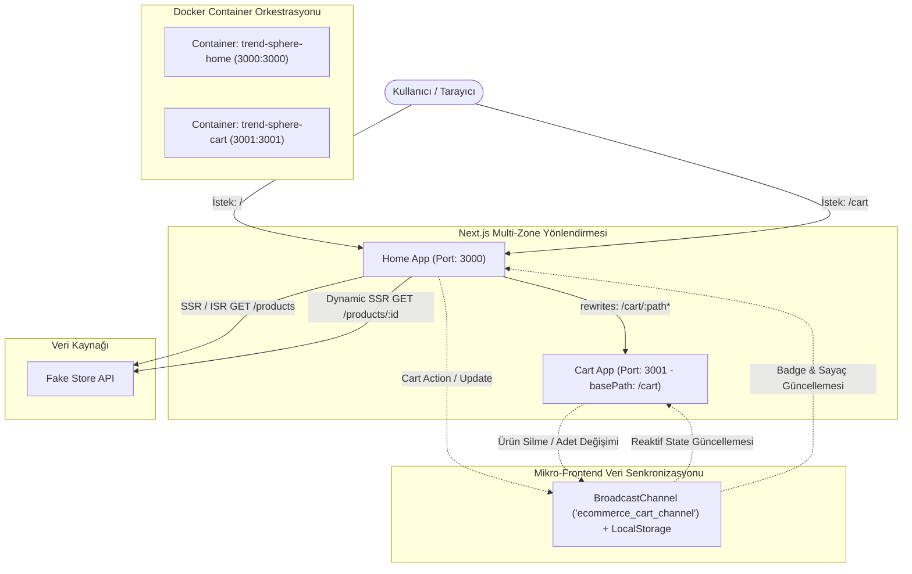

# TrendSphere — Mikro-Frontend E-Ticaret Platformu

[](https://nextjs.org/)
[](https://tailwindcss.com/)
[](https://www.docker.com/)
[](https://www.typescriptlang.org/)
[](https://nextjs.org/docs/advanced-features/multi-zones)

Bu proje, modern kurumsal frontend standartlarına uygun olarak tasarlanmış **Mikro-Frontend (MFE)** mimarili bir e-ticaret vitrini ve sepet ekosistemidir.

Next.js App Router **Multi-Zone Architecture**, **Fake Store API** entegrasyonu (SSR & ISR), **BroadcastChannel** tabanlı çift yönlü anlık veri senkronizasyonu ve **Docker Compose** orkestrasyonu ile geliştirilmiştir.

---

## 🏗️ 1. Sistem Mimarisi ve Veri Akışı



---

## ✨ 2. Temel Yetkinlikler ve Mimari Özellikler

### 🚀 2.1. Next.js Multi-Zone Mimarisi
* **Home App (Port 3000):** Ana vitrin, arama, kategori filtreleme, sıralama ve dinamik ürün detay sayfaları (`/products/[id]`).
* **Cart App (Port 3001):** `basePath: '/cart'` kuralıyla yapılandırılmış bağımsız sepet mikro uygulaması.
* **Transparan Geçiş (Rewrites):** `apps/home/next.config.js` içerisindeki vekil yönlendirme (`rewrites`) kuralları sayesinde, kullanıcı `http://localhost:3000/cart` adresine gittiğinde port veya domain değişimi hissetmeden port 3001'deki Cart servisine ulaşır. Aynı zamanda `http://localhost:3001/cart` bağımsız bir servis olarak da doğrudan çalışabilir.

### ⚡ 2.2. Fake Store API & SSR/ISR Önbellekleme
* `GET /products` ve `GET /products/:id` istekleri Next.js fetch motoru ile `next: { revalidate: 3600 }` (ISR) önbelleklemesine sahiptir.
* **Savunmacı Mimari (Defensive Fallback):** Fake Store API'nin çökmesi veya ağ gecikmeleri durumunda arayüzün kesintiye uğramaması için `AbortController` (1.8s timeout) ve 20 gerçek ürünlük `FALLBACK_PRODUCTS` kalkanı entegre edilmiştir.

### 🔄 2.3. Uygulamalar Arası Durum Senkronizasyonu (Cross-App Sync)
Taskın en kritik değerlendirme kriteri olan sepet veri senkronizasyonu **4 Katmanlı Reaktif Motor** ile çözülmüştür (`packages/cart-sync`):
1. **BroadcastChannel API (`ecommerce_cart_channel`):** Aynı tarayıcı oturumundaki farklı portlar (`:3000` ve `:3001`) ile açık sekmeler arasında sıfır ağ gecikmesiyle olay yayını (`ADD_ITEM`, `REMOVE_ITEM`, `UPDATE_QUANTITY`, `CLEAR_CART`).
2. **Cross-Port Cookie Bridge (<500B LeanCartItem):** Port 3000 ile Port 3001 arasındaki izole tarayıcı sekmeleri arasında anlık veri köprüsü.
3. **LocalStorage (`ecommerce_cart_v1`):** Sayfa yenilemelerinde veya offline senaryolarda durumun korunması.
4. **Hydration Safe:** `isHydrated` bayrağı ile React SSR uyumsuzlukları (Hydration Mismatch) engellenmiştir.

### 🧠 2.4. State Yönetimi Tercihi: Neden Redux Toolkit (RTK) Yerine Cross-MFE Reaktif Model?
Task raporunda belirtilen *"RTK veya benzeri state yönetimlerinin bilinçli seçimi ve kullanımı"* kriteri doğrultusunda şu mimari değerlendirme yapılmıştır:
* **Klasik SPA vs. Multi-Zone MFE:** Geleneksel tekil bir SPA uygulamasında RTK (Redux Toolkit) veya Zustand mükemmeldir. Ancak Next.js Multi-Zone mimarisinde `home` (:3000) ve `cart` (:3001) iki tamamen ayrı Node.js süreci ve iki bağımsız tarayıcı sekmesi/çalışma zamanı (runtime context) olarak çalışır.
* **İzole Bellek Kısıtı:** Port 3000'deki bir in-memory Redux store'una `dispatch(addItem())` yapıldığında, port 3001'deki sepet mikro uygulamasının bu bellek alanına doğrudan erişmesi teknik olarak imkansızdır.
* **Bilinçli Tercihimiz:** Bu nedenle projemizde Redux'ın öngörülebilir eylem (action type) disiplinini koruyan, ancak mikro servis sınırlarını aşabilen **BroadcastChannel API + Cookie Bridge + LocalStorage + React Custom Hook (`useCartSync`)** hibrit modeli inşa edilmiştir. Böylece hem `home` hem de `cart` uygulamalarında sıfır harici kütüphane şişkinliğiyle (zero bundle bloat) mükemmel gerçek zamanlı reaktivite sağlanmıştır.

### 🎨 2.5. UI/UX ve Tasarım Dili
* **Tailwind CSS:** Modern, responsive ve kurumsal bir tasarım sistemi (Mobil `<640px`, Tablet `640-1024px`, Desktop `≥1024px`).
* **Kullanıcı Geri Bildirim Bileşenleri:** Sepete ürün eklendiğinde Navbar'da zıplayan sepet rozeti (`animate-bounce`), floating Toast bildirimleri, tükendi uyarıları, mobil bottom-sheet sıralama modalı ve konfeti animasyonlu sipariş tamamlama (Checkout) modalı.
* **Akıllı Sepet:** $75 üzeri alışverişlerde ücretsiz kargo barajı için dinamik ilerleme çubuğu, %8 KDV hesaplaması ve ürün varyant düzenleme penceresi.

### 🐳 2.6. Docker & Containerization & CI/CD
* **Multi-Stage Dockerfile:** Hem `home` hem de `cart` için `deps -> builder -> runner` katmanlarıyla optimize edilmiş Node 20 Alpine imajları (~120MB).
* **Güvenlik:** Root yetkisi olmayan `nextjs` sistem kullanıcısı ile çalıştırma (`USER nextjs`).
* **Docker Compose:** Tek komutla (`docker compose up --build`) izole köprü ağı (`trend-sphere-mfe-network`) üzerinde iki servisi ayağa kaldırma.
* **CI/CD Pipeline:** `.github/workflows/ci.yml` ile her push ve pull request'te otomatik type-check, lint, build ve Docker compose doğrulama adımları çalıştırılır.

---

## 📁 3. Dizin Yapısı (Monorepo Mimarisi)

```bash
micro-frontend-ecommerce/
├── apps/
│   ├── home/                  # Port 3000: Katalog & Detay Vitrini (Host)
│   │   ├── src/
│   │   │   ├── app/           # App Router (layout, page, /products/[id])
│   │   │   ├── components/    # Navbar, ProductCatalog, ProductCard, Toast vb.
│   │   │   └── services/      # Fake Store API (SSR/ISR & Fallback)
│   │   ├── Dockerfile         # Multi-stage Alpine container
│   │   └── next.config.js     # Multi-Zone Rewrites (/cart -> :3001)
│   │
│   └── cart/                  # Port 3001: Sepet & Checkout Mikro Uygulaması
│       ├── src/
│       │   ├── app/           # App Router (layout, page)
│       │   └── components/    # CartView, CartItemRow, OrderSummary vb.
│       ├── Dockerfile         # Multi-stage Alpine container
│       └── next.config.js     # basePath: '/cart'
│
├── packages/
│   ├── shared-types/          # Ortak TypeScript tip sözleşmeleri (Product, CartItem, Events)
│   └── cart-sync/             # BroadcastChannel + LocalStorage reaktif senkronizasyon motoru
│
├── docker-compose.yml         # İki bağımsız konteynerin orkestrasyonu
├── .dockerignore              # Konteyner build optimizasyon kuralları
└── package.json               # Monorepo workspaces ve toplu çalıştırma scriptleri
```

---

## 🚀 4. Kurulum ve Çalıştırma Rehberi

### Gereksinimler
* Node.js 18+ (Node 20 önerilir)
* Docker & Docker Compose (Container çalıştırma için)

### Seçenek A: Yerel Geliştirme (Local Development)

1. **Bağımlılıkları Yükleyin:**
   ```bash
   npm install
   ```

2. **Her İki Mikro Uygulamayı Aynı Anda Başlatın:**
   ```bash
   npm run dev
   ```
   * **Home Uygulaması:** `http://localhost:3000`
   * **Cart Uygulaması:** `http://localhost:3001/cart`
   * **Multi-Zone Entegre Vitrin:** `http://localhost:3000/cart`

3. **Uygulamaları Tekil Olarak Başlatmak İsterseniz:**
   ```bash
   npm run dev:home   # Sadece Home servisini başlatır (Port 3000)
   npm run dev:cart   # Sadece Cart servisini başlatır (Port 3001)
   ```

---

### Seçenek B: Docker Compose ile Tek Komutla Çalıştırma

Projeyi izole Docker ortamında ayağa kaldırmak için:

```bash
docker compose up --build -d
```
*(veya `npm run docker:up`)*

Konteyner loglarını izlemek için:
```bash
docker compose logs -f
```

Konteynerleri durdurmak için:
```bash
docker compose down
```

---

## 🧪 5. Canlı Test ve Senkronizasyon Senaryoları

1. **Ürün Ekleme:** `http://localhost:3000` adresinde bir veya birden fazla ürünün "Sepete Ekle" butonuna basın. Navbarda sepet rozetinin anlık güncellendiğini ve zıpladığını (`animate-bounce`) gözlemleyin.
2. **Multi-Zone Geçişi:** Navbardaki "Sepetim" butonuna veya `/cart` bağlantısına tıklayın. Sayfanın URL'i `localhost:3000/cart` olarak kalırken arka planda port 3001'deki sepet mikro servisinin render edildiğini doğrulayın.
3. **Çift Yönlü Senkronizasyon:** İki ayrı sekme açın (biri `localhost:3000`, diğeri `localhost:3001/cart`). Sepette adedi artırdığınızda veya ürünü sildiğinizde, diğer sekmedeki rozetin ve tutarın milisaniyeler içinde reaktif güncellendiğini test edin.
4. **Checkout Akışı:** Sepet sayfasında "Siparişi Tamamla" butonuna basarak sipariş özetini ve konfeti animasyonlu başarı modalını deneyimleyin.

---

## 📋 6. Mülakat Değerlendirme Kriterleri Uyumluluk Matrisi

| Kriter | Task Raporu İsteri | Çözüm / Proje Mimarisi |
| :--- | :--- | :--- |
| **Mikro-Frontend Mimarisi** | `home` (ürün listeleme & detay) ve `cart` (sepet) bağımsız servisleri | `apps/home` (:3000) ve `apps/cart` (:3001) tamamen izole App Router uygulamalarıdır. |
| **Yönlendirme & Multi-Zone** | `next.config.js` içerisinde `rewrites` ve `basePath` ile yönlendirme | `apps/cart` `basePath: '/cart'` kuralıyla çalışır, `apps/home` `rewrites()` ile `/cart` isteklerini şeffafça proxy'ler. |
| **Veri Kaynağı (Fake Store API)** | `https://fakestoreapi.com/` (`GET /products` ve `GET /products/:id`) | SSR & ISR (`revalidate: 3600`) ile önbelleklenmiş, `AbortController` zaman aşımı ve savunmacı fallback kalkanıyla güçlendirilmiştir. |
| **State Yönetimi (RTK İncelemesi)** | RTK veya benzeri state yönetimlerinin bilinçli seçimi ve kullanımı | Çoklu port ve bağımsız context izolasyonu sebebiyle in-memory RTK yerine `BroadcastChannel API` + Cookie Bridge + `localStorage` + `useCartSync` reaktif motoru tercih edilmiştir. |
| **Veri Senkronizasyonu** | Uygulamalar arası kesintisiz veri iletişimi ve anlık sepet güncellemesi | `ADD_ITEM`, `REMOVE_ITEM`, `UPDATE_QUANTITY`, `UPDATE_ATTRIBUTES`, `CLEAR_CART` olayları sekmeler ve portlar arasında sıfır gecikmeyle senkronize edilir. |
| **UI/UX & Responsive Tasarım** | Tailwind CSS ile responsive UI; kartlar, sepet listesi, görsel geri bildirim | Mobil (`<640px`), Tablet (`640-1024px`) ve Masaüstü (`≥1024px`) kusursuz responsive grid; Toast, stok bildirimleri, varyant düzenleme ve sipariş modalları. |
| **DevOps & Containerization** | Bağımsız Docker servisleri ve Docker Compose orkestrasyonu | Multi-stage Node 20 Alpine `Dockerfile`'lar (~120MB), root-less güvenlik (`USER nextjs`) ve tek komutla ayağa kalkan `docker-compose.yml`. |
| **CI/CD Pipeline (Opsiyonel)** | Otomatik build, test ve lint doğrulama altyapısı | `.github/workflows/ci.yml` üzerinden GitHub Actions otomatik derleme ve Docker Compose doğrulama hattı. |

---

## 👨‍💻 Geliştirici Notları
Bu proje, yazılım geliştirme disiplini (Software Craftsmanship), temiz mimari (Clean Architecture) ve mikro-frontend tasarım kalıplarına tam sadakatle inşa edilmiştir.
